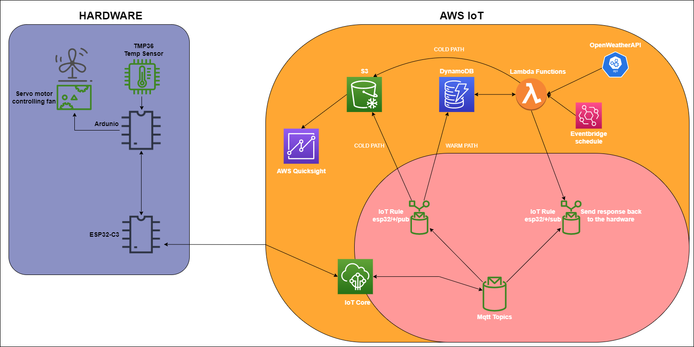

<h1>
    
Temperature Controlled Fan

</h1>
    <h4>
        Kim Jogholt   Nackademin - IoT21  
    </h4>
      

## **Table of contents**
---

1. [Project Description](#project-description)
    - [Background](#background)
    - [Solution](#solution)
    - [Problems](#current-problems)

2. [Setup](#setup)
    - [Physical components](#physical-components)
    - [AWS Setup](#aws-setup)
    - [Component summary](#component-summary)

3. [Flowchart](#flowchart)

---

## **Project Description**

### Background
This is based on a school project in an IoT and Cloudservices course.
I got this Idea while playing horror games with my mates. After intense moments I started noticing how warm it was and the PC spewing hot air from the back of it wasn't helping the room temperature getting any lower either. So I figured this was a great opportunity to make some DYI project using a fan and a microcontroller.

### Solution
So the idea is to send temperature data from a sensor connected to my arduino I have on my desk, to AWS IOT Core, Compare it to outside temperature fetched from OpenWeather API and return a response to my arduino, which then decides what action to take. Either tell me to open the windows if its colder outside or turn on the fan for a short period.

### Current problems
However since this is the first time for me using AWS and an ESP32 the time I had to make this work wasn't enough and I haven't gotten the response to work fully so this version currently only uploads sensor data and fetches API data and stores it in DynamoDB. The current version is able to send back a response reading the sensor data and tell wether to turn on the fan or not depending on the threshold that I put (25 C°) but its currently unable to compare it to the weather API.
I was also going to be using AWS Quicksight to visualize the temperature values on a graph however there seems to be some limitations on what apps you can use if you have chosen Stockholm as your aws-region. So unfortunately i wasn't able to get that up and running, perhaps in later versions of this project!

---

## **Setup**

### Physical components
In this project im using an Arduino Uno R3 to read the value from a TMP36 sensor and converting it to celsius, through one of the analog pins on the arduino. The arduino then sends the temperature through the serial port on which I've got an ESP32-C3 hooked up reading data coming through. Once the esp has got wifi connection it tries to establish a connection with AWS through mqtt, publishing the data to the 'esp32/1/pub topic (The '1' being the device ID im using). I've also set up a topic rule that reads the temperature data being published to the topic and stores it in DynamoDB.

### AWS Setup

In aws I've set up a device, my esp32 and attached the right policies for it to be able to connect with its certificates and be able to publish and subscribe to topics. It  I've got a API call set up using a lambda function which stores the temperature data in DynamoDB, and attached it to a schedule using AWS Eventbridge that invokes the function every 15 minutes. 
I have just barely started on a lambda function which is supposed to compare API temp(outside) with sensor temp and send a response back to my hardware.

### Component Summary

- [Arduino Uno R3](https://store.arduino.cc/products/arduino-uno-rev3)
- [ESP32-C3-WROOM](https://www.electrokit.com/produkt/esp32-c3-wroom-utvecklingskort-med-risc-v/)
- [AWS Cloud](https://aws.amazon.com/)
- [DC Motor (Arduino Starter Kit)](https://store.arduino.cc/products/arduino-starter-kit-multi-language)
- [TMP36 Sensor (Arduino Starter Kit)](https://store.arduino.cc/products/arduino-starter-kit-multi-language)

---
## Flowchart

As you can see in the picture I've got rules applied to topics esp32/+/pub and sub, the + here is incase I would increase the number of devices connected it would still include their data in the rule, since the space where the + is represents the device id. 

<a href="#top">Return to top</a>

